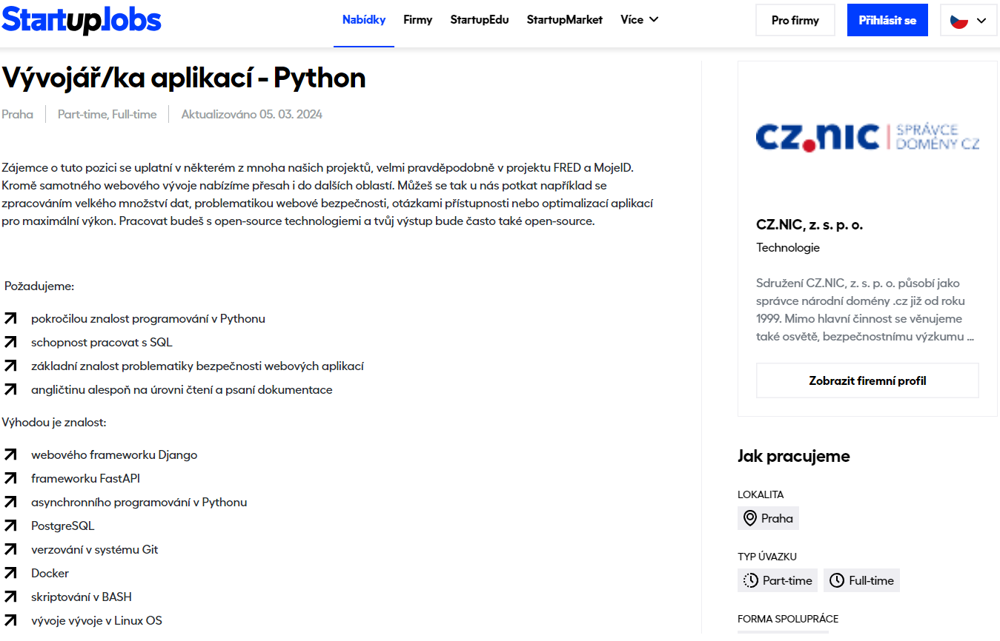
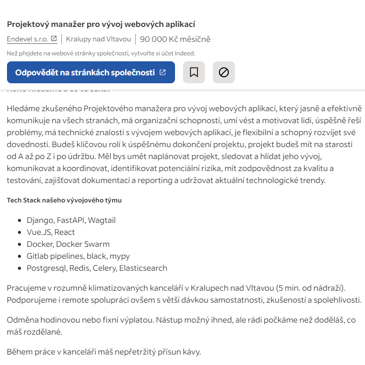

### FastAPI  
Abychom se dále mohlo bavit o FastAPI, tak nejdřív se musíme ujisti, že každý chápe pojem API.
## Co je to API
- API (Application Programming Interface) je soubor pravidel, protokolů a nástrojů, které umožňují různým softwarovým aplikacím vzájemně komunikovat.

# Jak to funguje
- Při používání se aplikace připojí k internetu a odesílá data na server. Server pak data zpracuje a odešle je zpět do aplikace. 
- Aplikace pak data interpretuje a prezentuje vám je v čitelné podobě. 

  

- Často se tohle fungování přirovnáva k restauraci.    
- Zákazník si chce něco objednat (má požadavek), tak si zavolá číšníka (API), který jeho požadavek předá kuchaři (někdo/něco, kdo připřavý požadavek). Následně číšník zase přijde a odnese     objednávku zpátky k zákazníkovi.

## Co je FastAPI
 - Vysoce výkonný webový framework pro vytváření rozhraní API v jazyce Python.
### Jak to funguje
 - FastAPI a obecně API pracujou s "operacemi cest" (Path). Myslí se tím část URL za první **/**
```
https://example.com/items/foo
```
"Path" je :
```
/items/foo
```  

>[!HINT] 
> Dále to budu nazývat endpointy...

FastAPI používá "operace", což zde odkazuje na HTTP metody:

- POST : Vytvoří data
- GET : Vrátí data
- PUT : Upraví data
- DELETE : Smaže data

Další zajimavé informace:
- OPTIONS : Zjistí povolené metody
- HEAD : vrátí HTTP headers
- PATCH : Podobný PUT
- TRACE : Testuje cestu k serveru

## Pydantic
 FastAPI je založena na knihovně Pydantic, která slouží pro validaci dat. 
 Jestli jsou ve správném formátu, správném typu aj.
 Blíže se s ní seznámíme dále

 
### Proč ho používat?

 Nápověda pro typy 
 Rychlá validace dat  
 Kompatibilní s JSON  
 Chybové hlášky  

### Podobnost s Flask
Ukázak kodu 
FastAPI
```
app = FastAPI()

@app.get("/hello/{name}")
async def get_hello(name: str):
    return {"message": f"Hello, {name}!"}
```
Flask
```
app = Flask(__name__)

@app.route("/hello/<name>")
def get_hello(name):
    return {"message": f"Hello, {name}!"}
```

## Výhody FastAPI
 :white_check_mark: Rychlejší (přispívá k tomu možnost asynchroního běhu)  
 :white_check_mark: Nápovědy k typům a ověřování dat (Pydantic)  
 :white_check_mark: Automatická dokumentace (Swagger UI)  
 :white_check_mark: Vestavěné vyhytávky (Flask si je muže přidat)  
 :white_check_mark: Založeno na OpenAPI  

## Nevýhody FastAPI
 :negative_squared_cross_mark: Těžší na naučení  
 :negative_squared_cross_mark: Méně rozšíření třetích stran  
Translated with DeepL.com (free version)  

# Využití na trhu
Speciálně pro pana Béra tady máme ještě sekci, "Má to využití v praxi?"
Krátká odpoveď: "ANO"  
S API se v dnešní době určitě dost pracuje a tento framework mi osobně přijde jako dobrá varianta při tvorbě API.  
Zde jsou 2 příklady poptávky práce:  
  
  
Společnosti, které FastAPI používají:  
Microsoft  
Netflix  
Uber

