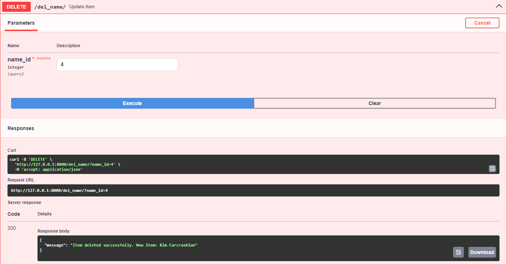

# Installation Instructions  

:one: Creating a virtual environment
```
python -m venv venv
```

:two: Activate the virtual environment so that we can install all the libraries here
```
venv\scripts\activate
```

:three: Installing the fastapi and uvicorn libraries
```
pip install fastapi uvicorn[standard]
```

:four: Creating a python file and importing FastAPI
```
from fastapi import FastAPI

app = FastAPI()
```

# Running the application
```
uvicorn {name of python file}:{name of FastAPI instance} --reload
```
In my case: 
```
uvicorn main:app --reload
```  
Our application is running on localhost at the address it dumped to the console.  

Alternatively, we can add /docs to the URL after our localhost address and the swaggerUI will appear.  

## What is SWAGGERUI  
It allows us to visualize and interact with our API without having to program any logic first.  
It automatically generates the environment according to our OpenAPI specifications  
More information [here](https://github.com/swagger-api/swagger-ui/blob/master/README.md)  
 
  

# Creating a database
Since the API usually communicates with a database of some sort, we'll use SQLite with SQLAlchemy to demonstrate.  
By constantly refreshing our application, we would also be deleting cookie data, which would be a delay.  
Here is the code to create the database:  

```  
from fastapi import FastAPI
from sqlalchemy import Column, Integer, String, create_engine, MetaData
from sqlalchemy.orm import declarative_base, sessionmaker

Base = declarative_base()
class Name(Base):
    __tablename__ = "names"
    id = Column(Integer, primary_key=True, autoincrement=True)
    name = Column(String(25))

engine = create_engine('sqlite:///:memory:')
metadata = MetaData()
Base.metadata.create_all(engine) # Create tables
Session = sessionmaker(bind=engine)

fake_names = [
    Name(name='Elon Muskrat'),
    Name(name="Johnny Depp-ression"),
    Name(name="Taylor Drift"),
    Name(name="Brad Pitstop"),
    Name(name="Angelina Joliet"),
    Name(name="Kim Carcrashian"),
    Name(name="Leonardo DiCapuccino"),
    Name(name="Miley Virus"),
    Name(name="Beyoncé Knows-all"),
    Name(name="Dwayne 'The pebble' Johnson")
]
session = Session()
session.add_all(fake_names)
session.commit()

app = FastAPI()
```  

# Basic Endpoints  

## GET endpoint  
We've already talked about endpoints. This is the basic syntax of endpoints, specifically GET.  
GET is used to retrieve data according to some specifications (we'll talk more about those below).
```
@app.get("/")
async def get():
    return {"message": "Hello World"}
```  
First we define what method this endpoint will apply to @app.get, after that we write the path for which it will apply ("nase/usasna/path").  
After that, we define the method to always call and the corresponding code in it.  

Now we run the application. We'll look in the browser at the URL it wrote in the console and it should print this:    
```
{"message": "Hello World"}
```
  
We can try the same thing in SwaggerUI (after the "/" type docs)  

  
  

Let's try to dump all the data from the database:  
``` 
@app.get("/")
async def get_name():
    result = session.query(name).all()
    return result
``` 

## POST endpoint  
POST is an endpoint for adding/submitting data by the user.  

```
@app.post("/")
async def create_name(name: str):
    return {"message": f "Item {name} added successfully"}
```
For this we need already some sort of variable, some sort of "query" that carries the information we sent.  

TASK


Try to add a POST endpoint so that adding a name to the db works.   
Test with SwaggerUI  

  

  

> [!TIP]
> Distinguish the paths at each endpoint. If they were the same, FastAPI would not know which endpoint you are querying
> e.g. @app.get("/get_name") AND @app.post("/post_name")  

<details>
<summary> Solution </summary>

``` 
@app.post("/post_name")
async def post_name(post_name: str):
    result = session.add(name(name=post_name))
    return {"message": "Item added successfully"}
``` 

</details>
  
## PUT endpoint  
For the PUT endpoint, we already need 2 parameters. One identifier and the other, what we want to replace it with
```
@app.put("/put_name/")
async def put_name(name_id: int, name: str):
    return {"message": f"{old_name} updated successfully to {name}"}
```  
TASK

Try substituting the name you added for another.    
> [!TIP]
> db is indexed from 1  

Test again with SwaggerUI  

<summary> Solution </summary>

``` 
@app.post("/post_name")
async def post_name(post_name: str):
    result = session.add(name(name=post_name))
    return {"message": "Item added successfully"}
``` 
</details>

## DELETE endpoint
And the last basic endpoint is unexpectedly for deleting a record. All we need here is the identifier
```
@app.delete("/del_name/")
async def update_item(name_id: int):
    session.query(Name).filter(Name.id == name_id).delete()
    return {"message": "Item deleted successfully"}
```  
We can test this via SwaggerUI  
  

# Path and Query parameters
As we may have already noticed, FastAPI uses some form of parameters/variables. More specifically, they are divided into Path and Query.  
## Path
They are declared directly in Path using {} and as a parameter in a function.  
And as is the custom of variables, we can further work with them
```
@app.get("/gt_name/{name}")
async def get_name(name):
    return {"Hello": name}
``` 
Now, if we try this out, our output might look like this:


But also like this


Or like this


The reason is that we haven't told FastAPI what data type we require. So FastAPI doesn't bother with it and converts everything to the string type.  
We specify the variable type in the function parameters using **variable: type**

```
@app.get("/gt_name/{name_id}")
async def get_name(name_id: int):
    return {"number": name_id}
```
The subsequent output will be int:  


### Tasks on Path
1) Try inserting a string instead of a number. What happens?
<details>
<summary> Explanation </summary>

As we know, people are stupid and will most likely try to enter a non-numeric value. Thanks to the Pydantic library (which we'll learn more about later), we don't have to worry too much about this. If it works, it will try to convert it, if it doesn't, instead of crashing our application, it will give us an error message:  
```
{"detail":[{"type":"int_parsing","loc":["path","name"],  
"msg": "Input should be a valid integer,  
unable to parse string as an integer", "input": "pepa", "url": "https://errors.pydantic.dev/2.6/v/int_parsing"}]}
```
</details>

2) Try modifying the GET endpoint to make the PATH parameter a string type and output it.
What happens if I enter a numeric value there? And what if I enter a date?
> [!TIP]
> the string type is determined by **variable: str**  

<details>
<summary> Explanation </summary>
Yes, it didn't throw an error message. Because FastAPI is based on the Pydantic kihow which converts every value to a string
</details>

## Query 
For Path, we typed the values directly into the URL and FastAPI processed them. For Query, the data is sent via "points".  
Variables are declared only in () of the function. Once a variable is not part of the URL, it is automatically treated as a Query variable.  

```
@app.get("/gt_names/")
async def get_names(name_id: int):
    return {"Number": name_id}
```  
Query is the key-value pair in the URL that is after **?**.   
```
http://127.0.0.1:8000/gt_namse/?name_id=5
```  
If we had more than one defined, they are separated by **&**  
```
@app.get("/gt_names/")
async def get_names(name_id: int, name: str):
return {"Number": name_id, "Name": name}
```
```
http://127.0.0.1:8000/gt_namse/?name_id=5&name=Venca
```  

Or we can test using SwaggerUI  


We can set the query variables to the default value, or even set them to optional

```
@app.get("/gt_names/")
async def get_name(name_id: int = 0, name: union[str, None] = None)
return {"Number": name_id, "Name": name}
```
> [!NOTE]
> Since Python 3.10, we can define optional variables:
> name: str | None = None

When we're dumping from a database that has an awful lot of values, we can use the **skip** and **limit** parameters.  
We can also set default values

```
@app.get("/get_names/")
async def get_names(skip: int = 0, limit: int = 0):
    return session.query(name).limit(limit).offset(skip).all()
```

Of course, we can combine Path and Querry parameters or write several of them

```
@app.put("/names/{name_id}")
async def update_name(name_id: int, name: str):
return {"Number": name_id, "Name": name}
```


We can also validate the data using the Query and Annotated libraries, for example:  

```
@app.get("/Annotated/")
async def get_name(query: Annotated[str | None, Query(min_length=3, max_length=50, pattern="^fixedquery$")])
return {"query": query}
```
Using Annotated, we can declare additional information and variable parameters.  
Query in turn tells us a specific parameter. In this case:
Min/Max_length specifies the minimum/maximum length of the data.  
pattern - the data must be exactly equal to the text between **"^"** and **"$"**

Furthermore, thanks to this library we can request a whole list of values:  
```
@app.get("/Annotated/")
async def get_name(query: Annotated[list[str] | None, Query()] = None)
return {"query": query}
```

We can validate the variables in Path in the same way, except we won't import ~~Query~~, but **Path**

### Query tasks
1) Try defining a variable of type bool. Write an if condition to check True False + statement.  
Try entering all sorts of permutations of values of type true (true, true, on, yes..) 

<details>
<summary> Explanation </summary>

```
@app.get("/names")
async def get_name(bl: bool = False):
    if bl:
        return "Hodnota překonvertována na True"
    else:
        return "Hodnota překonvertována na False"
```
Zase nám pomáha knihovna Pydantic a všechno konvertuje na hodnotu True  

</details>

# Pydantic 
Když potřebujeme poslat data do API tak je posíláme jako "request body". Api nám poté posílá "response body"  
Abychom mohli takové "request body" poslat, využijeme k tomu knihovnu Pydantic.  

Nejprve si naimportujeme pydantic s BaseModel
```
from pydantic import BaseModel
```
Teď si deklarujeme náš data model, která dedí z BaseModel
```
class Name(BaseModel):
    first_name: str
    last_name: str | None = None
    age: int
```
Tím, že jsme si vytvořili tento model jako třídu, tak už nemusíme všechno vypisovat jako query parametry.  
Proměnné, které nejsou definované jako nepovinné (Union[str, None] **= None**), jsou vždy <code style="color:red">povinné</code>
```
@app.get("/names/")
async def update_name(name: Name):
name_dict = name.dict()
return {"First name:": name.first_name, "Last name": name.last_name}
```


### Tasks on Pydantic

Here you have the rewritten table and the values corresponding to the BaseModel.
class Name(Base):
    __tablename__ = "names"
    id = Column(Integer, primary_key=True, autoincrement=True)
    name = Column(String(25))
    last_name = Column(String(25))
    age = Column(Integer())

fake_names = [
    Name(name="Elon", last_name="Muskrat", age=53),
    Name(name="Johnny", last_name="Depp", age=55),
    Name(name="Taylor", last_name="Drift", age=23),
    Name(name="Brad", last_name="Pitstop", age=33),
    Name(name="Angelina Joliet", last_name="Joliet", age=48),
    Name(name="Kim Carcrashian", last_name="Carcrashian", age=43),
    Name(name="Leonardo DiCapuccino", last_name="DiCapuccino", age=49),
    Name(name="Miley Virus", last_name="Virus", age=31),
    Name(name="Beyoncé Knows-all", last_name="Knows-all", age=42),
    Name(name="Dwayne 'The pebble' Johnson", last_name="Johnson", age=51),
]  

TASK

Rewrite your POST endpoint to accept parameters according to BaseModel and populate the database correctly.

<details>
<summary> Solution </summary>

```
@app.post("/post_name")
async def post_name(f_name: str, l_name: str | None = None, ag: int):
    result = session.add(Name(first_name=first_name, last_name = l_name, age = ag))
    return {"message": "Item added successfully"}
```

</details>

TASK

Modify the GET endpoint to skip the first 2 values and output the next 5
<details>
<summary> Solution </summary>

```
@app.get("/get_names/")
async def get_names(skip: int = 0, limit: int = 0):
    return session.query(name).limit(limit).offset(skip).all()
```

</details>

# Sample usage

Translated with Deepl.com
