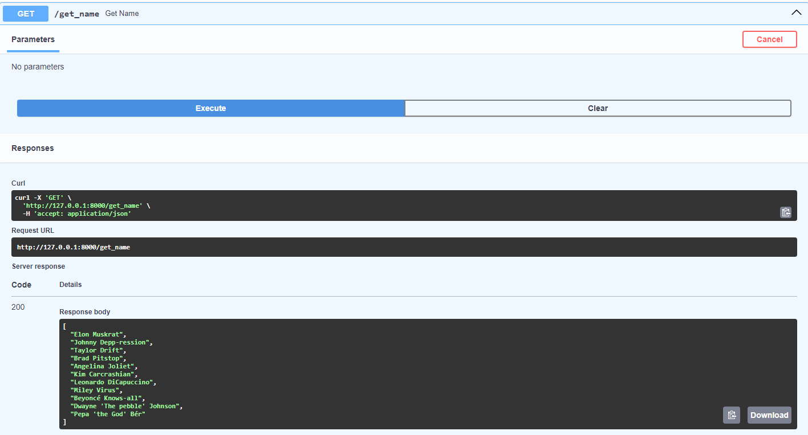

# FASTAPI
## Pro seznámení s FastAPI si nejdříve přečtětě [instruction](./INTRODUCTION.md)
# Návod na instalaci  

:one: Vytvoření virtuálního prostředí
```
python -m venv venv
```

:two: Aktivace virtuálního prostředí, aby se nám všechny knihovny instalovali sem
```
venv\scripts\activate
```

:three: Nainstalování knihoven fastapi a uvicorn
```
pip install fastapi uvicorn[standard]
```

:four: Vytvoření python souboru a naimportování FastAPI
```
from fastapi import FastAPI

app = FastAPI()
```

# Spouštění aplikace
```
uvicorn {jmeno python souboru}:{jmeno FastAPI instance} --reload
```
V mém případě: 
```
uvicorn main:app --reload
```  
Naše aplikace beží na localhostu na adrese, kterou nám to vypsalo do konzole.  

Alternativně můžeme do URL za náší localhost adresu připsat /docs a objeví se nám swaggerUI.  

Nebo, pokud by se nám swaggerUI nelíbil, můžeme použít Postman.

## Co je to SWAGGERUI  
- Dopřává nám možnost vizualizovat a interagovat s naší API bez toho, abychom si museli nejdřív naprogramovat nějakou logiku.  
- Automaticky to generuje prostředí podle našich OpenAPI specifikací  
- Víc informací [zde](https://github.com/swagger-api/swagger-ui/blob/master/README.md)  
 
  

## Co je to Postman
- Je aplikace, která nám umožňuje testovat API požadavky. Umožňuje nám mnohem víc, než SWAGGER Interface, ale pro naší malou aplikaci můžeme použít oboje  

  

# Vytvoření databáze
- Tím, že API většinou komunikuje s nějakou databází, tak pro názornou ukázku budeme používat SQLite s SQLAlchemy.  
- Zároveň budeme neustále refreshovat naší aplikaci, tak by se nám i mazala cookie data, což by zdržovalo.  
- Zde je kód pro vytvoření databáze:  

```  
from fastapi import FastAPI
from sqlalchemy import Column, Integer, String, create_engine, MetaData
from sqlalchemy.orm import declarative_base, sessionmaker

Base = declarative_base()
class Names(Base):
    __tablename__ = "names"
    id = Column(Integer, primary_key=True, autoincrement=True)
    name = Column(String(25))

engine = create_engine('sqlite:///:memory:')
metadata = MetaData()
Base.metadata.create_all(engine)  # Vytvoření tabulek
Session = sessionmaker(bind=engine)

fake_names = [
    Name(name="Elon Muskrat"),
    Name(name="Johnny Depp-ression"),
    Name(name="Taylor Drift"),
    Name(name="Brad Pitstop"),
    Name(name="Angelina Joliet"),
    Name(name="Kim Carcrashian"),
    Name(name="Leonardo DiCapuccino"),
    Name(name="Miley Virus"),
    Name(name="Beyoncé Knows-all"),
    Name(name="Dwayne 'The pebble' Johnson")
]
session = Session()
session.add_all(fake_names)
session.commit()

app = FastAPI()
```  

# Základní Endpointy  

## GET endpoint  
- O endpointech jsme si už říkali. Toto je základní syntaxe endpointů, specificky GET.  
- GET slouží pro získávání dat dle nějakých specifikací. (O těch si víc povíme níže)
```
@app.get("/")
async def get():
    return {"message": "Hello World"}
```  
Nejdříve definujeme, jaké metody se tento endpoint bude týkat @app.get, za to napíšeme cestu, pro kterou to bude platit ("nase/uzasna/cesta").  
Poté definujeme metodu, kterou do má vždy zavolat a do ní příslušný kód.  

Teď spustíme aplikaci. Podíváme do prohlížeče na URL adresu, kterou nám to napsalo v konzoli a mělo by nám to vypsat toto:    
```
{"message": "Hello World"}
```
  
To samé si můžeme vyzkoušet ve SwaggerUI [zde](http://127.0.0.1:8000/docs)  
  

Zkusíme si vypsat všechny data z databáze:  
``` 
@app.get("/")
async def get_name():
    result = session.query(Names).all()
    return result
``` 

## POST endpoint  
- POST je endpoint naopak pro přidávání/odesílání dat uživatelem.  

```
@app.post("/")
async def create_name(name: str):
    return {"message": f"Item {name} added successfully"}
```
- K tomu potřebujeme už nějakou proměnou, nějaké "query", která nám nese informace, které jsme poslali.  

### ÚKOL


Zkuste si doplnit POST endpoint tak, aby fungovalo přidávání jména do db.   
Otestujte pomocí SwaggerUI  

  

  

> [!TIP]
> Rozlište si cesty u jednotlivých endpointů. Pokud by byli stejné, tak by FastAPI nevědělo, na jaký endpoint se dotazujete  
> např @app.get("/get_name") AND @app.post("/post_name")  

<details>
<summary> Řešení </summary>

``` 
@app.post("/post_name")
async def post_name(post_name: str):
    result = session.add(Names(name=post_name))
    return {"message": "Item added successfully"}
``` 

</details>
  
## PUT endpoint  
- U endpointu PUT už potřebujeme parametry 2. Jeden identifikátor a druhý, čím to chceme nahradit
```
@app.put("/put_name/")
async def put_name(name_id: int, name: str):
    return {"message": f"{old_name} updated successfully to {name}"}
```  
### ÚKOL

Zkuste zaměnit jméno, které jste si přidali za jiné.    
> [!TIP]
> db se indexuje od 1  

Zase otestujte přes SwaggerUI  

<details>
<summary> Řešení </summary>

``` 
@app.post("/post_name")
async def post_name(post_name: str):
    result = session.add(Names(name=post_name))
    return {"message": "Item added successfully"}
``` 
</details>

## DELETE endpoint
- A poslední základné endpoint je nečekaně na mazání záznamu. Tady už potřebujeme akorát identifikátor
```
@app.delete("/del_name/")
async def update_item(name_id: int):
    session.query(Names).filter(Names.id == name_id).delete()
    return {"message": "Item deleted successfully"}
```  
Můžeme to otestovat přes SwaggerUI  

  

# Path a Query parametry
- Jak už jsme si mohli všimnout, FastAPI používá nějakou formu parametrů / proměnných. Přesněji se dělí na Path a Query.  
## Path
- Deklarují se přímo v Path pomocí {} a jako parametr ve funkci.  
- A jak je zvykem proměnných, můžeme s nimi dále pracovat
```
@app.get("/gt_name/{name}")
async def get_name(name):
    return {"Hello": name}
``` 
Teď, když si to vyzkoušíme, tak náš výstup by mohl vypadat takto:


Ale i takto


Nebo takto


Důvod je, že jsme neřekli FastAPI, jaký datový typ požadujeme. Tak se s tím FastAPI nijak netrápí a všechno konvertuje na typ string.  
Typ proměnné určíme v parametrech funkce pomocí **proměnná: typ**

```
@app.get("/gt_name/{name_id}")
async def get_name(name_id: int):
    return {"Number": name_id}
```
Následný output už bude int:  


### Úkoly na Path
1) Zkuste místo čísla vložit nějaký řetězec. Co se stane?
<details>
<summary> Vysvětlení </summary>

Jak víme, lidi jsou hloupý a s velkou pravděpodobností zkusí zadat jinou než numerickou hodnotu. Díky knihovně Pydantic (o kterém se dozvíme víc později) se o to nemusíme moc starat. Pokud to půjde, tak to zkusí překonvertovat, pokud ne, tak místo toho, aby nám aplikace spadla, tak nám vypíše chybovou hlášku:  
```
{"detail":[{"type":"int_parsing","loc":["path","name"],  
"msg":"Input should be a valid integer,  
unable to parse string as an integer","input":"pepa","url":"https://errors.pydantic.dev/2.6/v/int_parsing"}]}
```
</details>

## Query 
- U Path jsme psali hodnoty přímo do URL a FastAPI si je potom zpracovalo. U Query se data posílají přes tzv. "body".  
- Proměnné se deklarují jen v () u funkce. Jakmile proměnná není součástí URL, je automaticky považována za Query proměnnou.  

```
@app.get("/gt_names/")
async def get_names(name_id: int):
    return {"Number": name_id}
```  
Query je pár klíč-hodnota v URL, která je za **?**.   
```
http://127.0.0.1:8000/gt_namse/?name_id=5
```  
Kdybychom jich měli definovaných více, oddělují se pomocí **&**  
```
@app.get("/gt_names/")
async def get_names(name_id: int, name: str):
return {"Number": name_id, "Name": name}
```
```
http://127.0.0.1:8000/gt_namse/?name_id=5&name=Venca
```  

  

Nebo můžeme testovat pomocí SwaggerUI  

Query proměnné můžeme nastavit defaultni hodnotu, nebo je dokonce nastavit na nepovinné

```
@app.get("/gt_names/")
async def get_name(name_id: int = 0, name: Union[str, None] = None)
return {"Number": name_id, "Name": name}
```
> [!NOTE]
> Od Pythonu 3.10 můžeme nepovinné proměnné definovat:
> name: str | None = None

Když vypisujeme z databáze, která má strašně moc hodnot, tak můžeme využít paramtry **skip** a **limit**.  
Rovnou můžeme nastavit defaultní hodnoty
  

```
@app.get("/get_names/")
async def get_names(skip: int = 0, limit: int = 0):
    return session.query(Names).limit(limit).offset(skip).all()
```
  
Samozřejmě můžeme kombinovat Path a Querry parametrs nebo jich napsat několik
  

```
@app.put("/names/{name_id}")
async def update_name(name_id: int, name: str):
return {"Number": name_id, "Name": name}
```
  
  
Dále můžeme validovat data pomocí knihoven Query a Annotated, například:  

```
@app.get("/Annotated/")
async def get_name(query: Annotated[str | None, Query(min_length=3, max_length=50, pattern="^fixedquery$")])
return {"query": query}
```
Pomocí Annotated můžeme deklarovat další informace a parametry promenný.  
Query nám zase říká určitý parametr. V tomto případě:
Min/Max_length udává minimální/maximální délku dat.  
pattern - data se musí přesně rovnat textu mezi **"^"** a **"$"**

Dále díky této knihovně můžeme požadovat klidně celý list hodnot:  
```
@app.get("/Annotated/")
async def get_name(query: Annotated[list[str] | None, Query()] = None)
return {"query": query}
```

Úplně stejně můžeme validovat i proměnné v Path, akorát nebudeme importovat ~~Query~~, ale **Path**

### Úkoly na Query
1) Zkuste si definovat promennou typu bool. Napište si if podmínku na kontrolu True False + výpis.  
Zkuste zadávat všemožné obměny hodnot typu pravda (true, True, on, yes..) 

<details>
<summary> Vysvětlení </summary>

```
@app.get("/names")
async def get_name(bl: bool = False):
    if bl:
        return "Hodnota překonvertována na True"
    else:
        return "Hodnota překonvertována na False"
```
Zase nám pomáha knihovna Pydantic. Hodnoty jako jsou True, true, on, yes a 1 konvertuje na True  

</details>

# Pydantic 
Když potřebujeme poslat data do API tak je posíláme jako "request body". Api nám poté posílá "response body"  
Abychom mohli takové "request body" poslat, využijeme k tomu knihovnu Pydantic.  

Nejprve si naimportujeme pydantic s BaseModel
```
from pydantic import BaseModel
```
Teď si deklarujeme náš data model, který dědí z BaseModel
```
class Names(BaseModel):
    first_name: str
    last_name: str | None = None
    age: int
```
Tím, že jsme si vytvořili tento model jako třídu, tak už nemusíme všechno vypisovat jako query parametry.  
Proměnné, které nejsou definované jako nepovinné (Union[str, None] **= None**), jsou vždy <code style="color:red">povinné</code>
```
@app.get("/names/")
async def update_name(name: Names):
name_dict = name.dict()
return {"First name:": name.first_name, "Last name": name.last_name}
```


### Úkol na Pydantic

Zde máte přepsaný tabulku a hodnoty odpovídajíc BaseModelu.  

```
class Name(Base):
    __tablename__ = "names"
    id = Column(Integer, primary_key=True, autoincrement=True)
    name = Column(String(25))
    last_name = Column(String(25))
    age = Column(Integer())

fake_names = [
    Names(name="Elon", last_name="Tusk", age=53),
    Names(name="Johnny", last_name="Depp-ression", age=55),
    Names(name="Taylor", last_name="Drift", age=23),
    Names(name="Brad", last_name="Pitstop", age=33),
    Names(name="Angelina", last_name="Joliet", age=48),
    Names(name="Kim", last_name="Carcrashian", age=43),
    Names(name="Leonardo", last_name="DiCapuccino", age=49),
    Names(name="Miley", last_name="Virus", age=31),
    Names(name="Beyoncé", last_name="Knows-all", age=42),
    Names(name="Dwayne 'The pebble'", last_name="Johnson", age=51),
] 
```  

ÚKOL

Přepiště si POST endpoint, aby přijímal parametry podle BaseModelu a doplňoval správně do databáze.

<details>
<summary> Řešení </summary>

```
@app.post("/post_name")
async def post_name(f_name: str, l_name: str | None = None, ag: int):
    result = session.add(Name(first_name=first_name, last_name = l_name, age = ag))
    return {"message": "Item added successfully"}
```

</details>

ÚKOL

Upravte endpoint GET podle následujícího screenu:  

<details>
<summary> Řešení </summary>

```
@app.get("/get_names/")
async def get_names(skip: int = 0, limit: int = 0):
    return session.query(Name).limit(limit).offset(skip).all()
```

</details>

